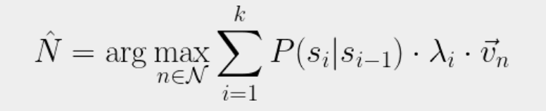

<h3 align="center">Lets see if we can guess your name!</h3>

# Main Idea

- Our main idea is to make an algorithm that can guess someone’s name based on a series of questions
- Created without the use of AI in order to preserve the idea of coding, keeping the legacy of it alive. 
- Shows how easily large corporations can get your information, teaching people to be more aware on what you are sharing with the internet.

### Why We Did This

- Looking for a way to show our coding and mathematical skills that would impress other people with them still being able to understand it
- Inspired by a youtube video about prediction chains and we realized that we could predict somone’s name using a similar algorithm
- We also “borrowed” some ideas from the Akinator to help boost our accuracy rate for our algorithm

# Algorithm

- Through 2000 lines of typescript we were able to successfully make an algorithm that can guess your name with a 98% accuracy
- The algorithm is based off of markov chains, which is a mathematical statistics’ equation for predicting the next thing in a sequence, based on information that is given.
- The algorithm took us around 1.5 weeks to find, and another 5 days to implement successfully.

### Our Equation

Our equation scores each possible name (the ‘n’ variable) by computing a weighted sum of Markov transition probabilities across the input sequence. The most important part is the ‘P(s_i | s_{i-1})’. Basically it gives the likelihood of each observed state given the previous one. λᵢ weights each step by its predictive relevance. The result is then projected onto vₙ, (a name-specific probability vector) and the highest-scoring candidate is returned as the prediction. So in summary, it guesses until it gets it right, but after each guess it gets smarter. (Because of the λᵢ loss property)
